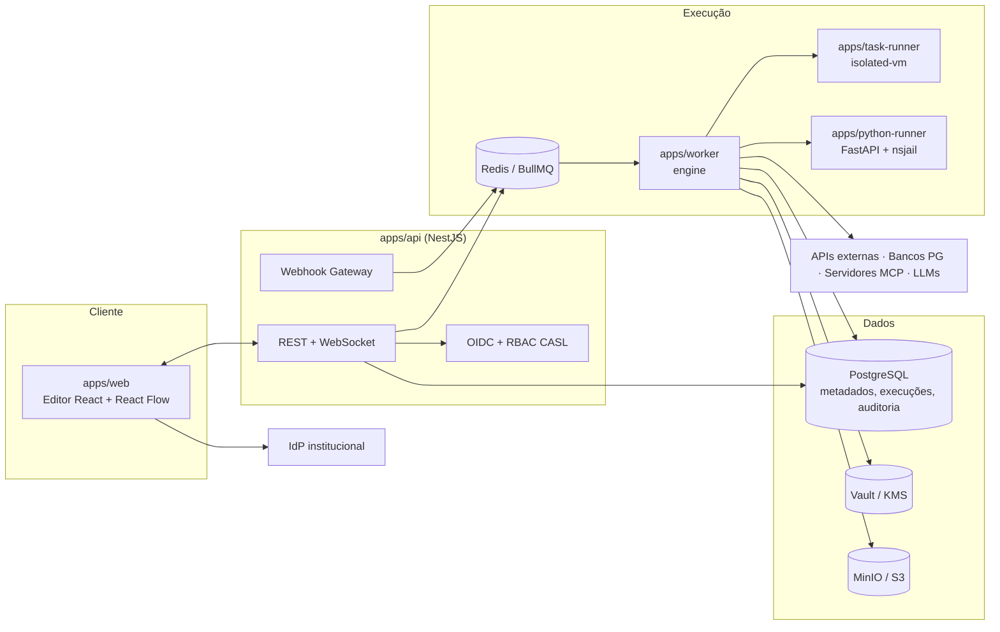
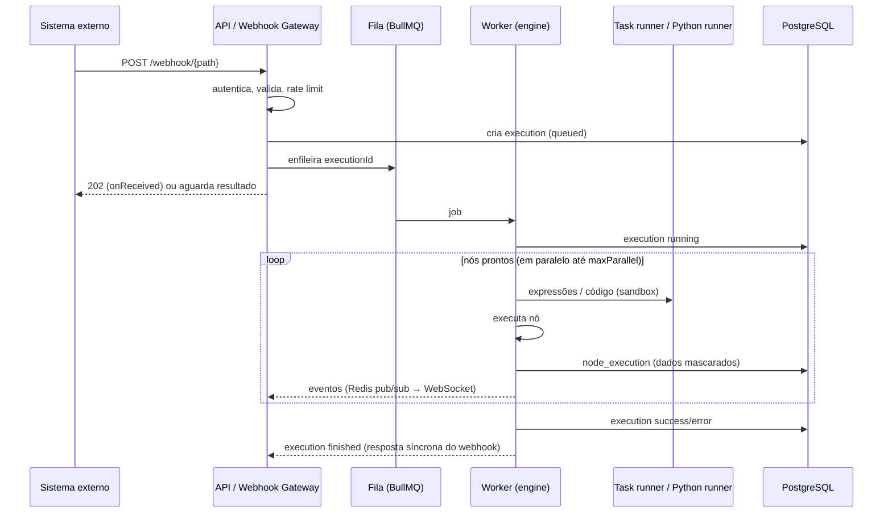

# Arquitetura — Visão Geral

> Visão consolidada do sistema-alvo. Cada spec detalha a sua parte no próprio `plan.md`.

## Componentes

| Componente | Responsabilidade | Spec de origem |
|---|---|---|
| `apps/web` | Editor visual, painéis de nó, execuções, administração | 001, 002 |
| `apps/api` | REST, WebSocket, autenticação, RBAC, webhooks, publicação | 001, 002, 005 |
| `apps/task-runner` | Expressões e código JS em isolated-vm (processo separado) | 003, 005 |
| `apps/worker` | Consome a fila e executa workflows com o engine | 006 |
| `apps/python-runner` | Código Python em subprocesso nsjail, sem rede | 008 |
| `packages/engine` | Agendador de DAG, estado da execução, loops, erros | 002, 006, 007 |
| PostgreSQL | Metadados, versões, execuções particionadas, auditoria | 001+ |
| Redis | Fila, pub/sub de eventos, locks, cotas | 006 |
| Vault/KMS | Chave mestra das credenciais (ADR-0007) | 009 |
| MinIO/S3 | Binários e payloads grandes | 004, 009 |

## Ciclo de vida de uma execução

## Semântica de execução (resumo)

Detalhada em `docs/execucao.md`, produzido pelas specs 006 e 007.

- O workflow é um grafo dirigido. Um nó fica **pronto** quando todas as suas entradas conectadas foram resolvidas, seja com dados ou com "sem dados".
- Ramo sem itens não executa os nós seguintes, e propaga "sem dados" para não bloquear Merges.
- Nós prontos executam em paralelo até `maxParallel`. O resultado é determinístico, independentemente da ordem de conclusão.
- Ciclos só são permitidos pela porta `continue` de `logic.while` ou `logic.loopOverItems`, com `maxIterations`.
- Erros por nó: `retry`, `timeout` e `onError` (`stop` | `continue` | `errorOutput`), além do *error workflow*.

## Segurança em camadas

| Ameaça | Controle | Spec |
|---|---|---|
| Fuga de sandbox (JS) | isolated-vm em processo separado, limites | 003, 005, 008 |
| Fuga de sandbox (Python) | nsjail, sem rede, FS somente leitura, NetworkPolicy | 008, 012 |
| SSRF | Guard com resolução de DNS e validação de IP e redirects | 004, 010 |
| SQL injection | Parametrização obrigatória; expressões proibidas no SQL | 004 |
| Vazamento de credenciais | Envelope encryption, Vault/KMS, nunca serializadas | 004, 009 |
| Acesso indevido | OIDC + RBAC por projeto + teste de cobertura de rotas | 001, 002, 005 |
| Prompt injection / tool poisoning | Allowlist, snapshot de tools, aprovação humana, limite de passos | 010, 011 |
| Exposição de dados pessoais | Mascaramento antes de persistir; retenção | 009 |
