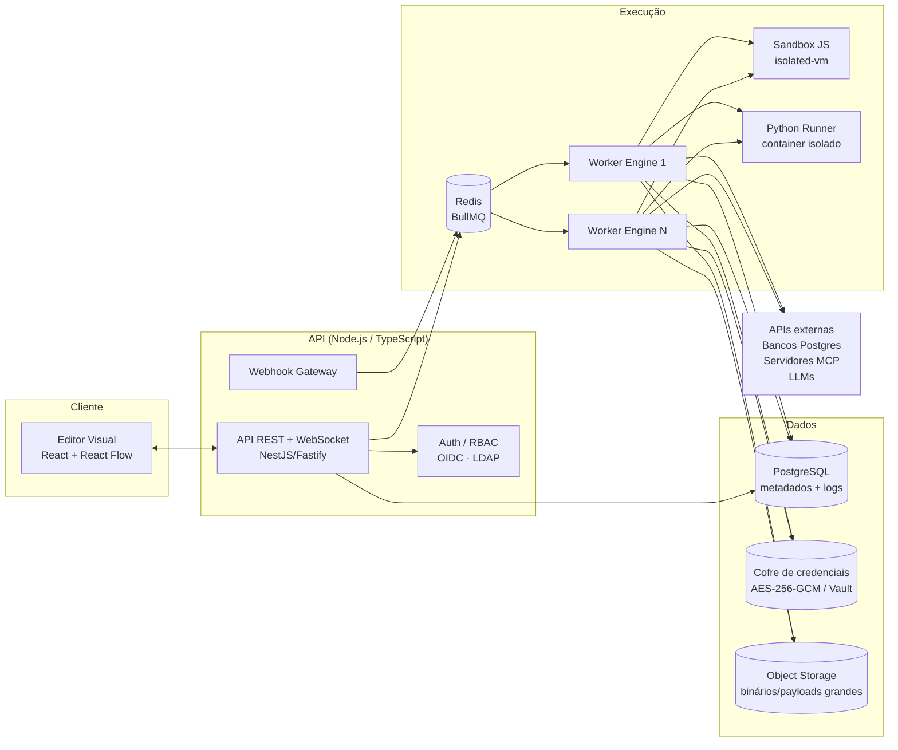

# Análise de Implementação — Plataforma de Workflows Visuais com IA (Olly Flow)

> ⚠️ **Documento de estudo (não normativo).** Registra a análise de viabilidade original. As fontes de verdade são a [constituição](../../.specify/memory/constitution.md), as [ADRs](../adr/) e as [specs](../../specs/).

> **Objetivo:** avaliar a viabilidade e propor uma arquitetura para construir uma plataforma interna de automação de workflows visuais, nos moldes do N8N, com foco em IA/Agents, governança institucional e execução segura de código.
>
> **Data:** 02/10/2026 · **Status:** abordagem híbrida aprovada — ver [ADR-0001](../adr/0001-abordagem-hibrida.md)

---

## Sumário

1. [Cenário atual](#1-cenário-atual)
2. [Análise de viabilidade](#2-análise-de-viabilidade)
3. [Build vs. Buy — alternativas de mercado](#3-build-vs-buy--alternativas-de-mercado)
4. [Arquitetura proposta](#4-arquitetura-proposta)
5. [Modelo do workflow e motor de execução](#5-modelo-do-workflow-e-motor-de-execução)
6. [Especificação dos nós](#6-especificação-dos-nós)
7. [RBAC — controle de acesso](#7-rbac--controle-de-acesso)
8. [Logs de execução e auditoria](#8-logs-de-execução-e-auditoria)
9. [Segurança](#9-segurança)
10. [Modelo de dados (PostgreSQL)](#10-modelo-de-dados-postgresql)
11. [Roadmap e estimativa de esforço](#11-roadmap-e-estimativa-de-esforço)
12. [Riscos e mitigações](#12-riscos-e-mitigações)
13. [Conclusão e recomendação](#13-conclusão-e-recomendação)

---

## 1. Cenário atual

| Item | Situação |
|---|---|
| POC | Realizada com N8N, considerada funcional |
| Objetivo | Plataforma própria, visual, para criar e executar workflows com IA/Agents |
| Público | Times técnicos e, potencialmente, analistas de negócio |
| Integrações-chave | HTTP/APIs, PostgreSQL, MCP (Model Context Protocol), código JS/Python |
| Requisitos não funcionais | RBAC, log de todas as execuções, paralelismo, governança |

### O que a POC com N8N validou

- O **paradigma visual** (nós + conexões) é adequado ao público.
- O modelo de **itens fluindo entre nós** (cada nó recebe/produz uma lista de objetos JSON) é intuitivo.
- Há demanda real por orquestrar **LLMs + ferramentas + dados institucionais**.

### Por que considerar uma solução própria

- **Governança:** recursos como RBAC granular, SSO/LDAP e *log streaming* no N8N ficam em planos pagos (Enterprise).
- **Licença:** o N8N usa a *Sustainable Use License* (fair-code), que permite uso interno, mas restringe redistribuição e oferta como serviço — isso limita customizações profundas e reaproveitamento.
- **Controle:** integração nativa com AD/LDAP da instituição, trilha de auditoria no padrão interno, aderência à LGPD, execução de código em sandbox sob nosso controle.
- **Foco em IA:** nós de Agent/MCP/LangChain como cidadãos de primeira classe, não como plugins.

---

## 2. Análise de viabilidade

### 2.1 Viabilidade técnica — **ALTA**

Todos os componentes necessários têm bibliotecas maduras no ecossistema Node/Python:

| Necessidade | Solução madura disponível |
|---|---|
| Editor visual de grafos | **React Flow (xyflow)** — mesmo tipo de base usada por diversas ferramentas do mercado |
| Fila e workers distribuídos | **BullMQ + Redis** |
| Sandbox JavaScript | **isolated-vm** (V8 isolates com limite de memória/tempo) |
| Sandbox Python | Container dedicado com **nsjail / gVisor** ou processo isolado com limites de recursos |
| Cliente MCP | **@modelcontextprotocol/sdk** (SDK oficial TypeScript) |
| Agents/LLM | **LangChain.js / LangGraph.js** (ou LangChain Python no runner Python) |
| PostgreSQL | **pg / node-postgres** com queries parametrizadas |
| Autenticação/SSO | **Keycloak** ou integração direta OIDC/LDAP |
| Observabilidade | **OpenTelemetry** + Grafana/Loki/Tempo ou ELK |

### 2.2 Viabilidade de esforço — **MÉDIA**

O editor visual é a parte *mais visível*, mas **não** a mais difícil. A complexidade real está em:

1. **Motor de execução** robusto (paralelismo, merge, loops, retomada, erros, timeouts).
2. **Execução segura de código arbitrário** (JS e Python) — risco de segurança relevante.
3. **Sistema de expressões** (`{{ $json.campo }}`) com boa experiência de uso (autocomplete, preview).
4. **Manutenção contínua:** cada novo nó/integração é código a ser mantido.

> Estimativa: **MVP utilizável em ~3 meses** e **versão de produção em ~5–6 meses** com equipe de 4 pessoas (detalhes na seção 11).

### 2.3 Viabilidade operacional — **MÉDIA/ALTA**

Exige: Kubernetes ou Docker Compose em produção, Redis, PostgreSQL, gestão de segredos e um time responsável pela sustentação da plataforma (não é um projeto "entrega e esquece").

### 2.4 Matriz de viabilidade por requisito

| Requisito | Complexidade | Observação |
|---|---|---|
| Nó **While** | Média | Exige suporte a ciclos controlados no grafo + limite de iterações |
| Nó **If** | Baixa | Duas saídas (true/false) |
| Nó **HTTP Request** | Baixa/Média | Atenção a SSRF, timeouts, retries, paginação |
| **Query PostgreSQL** | Baixa | Queries parametrizadas obrigatórias |
| **Insert/Update PostgreSQL** | Baixa/Média | Mapeamento de colunas, upsert, transação |
| **Webhook de entrada** | Média | Roteamento dinâmico, autenticação, modos de resposta |
| **Log de execuções** | Média | Volume de dados, retenção, mascaramento |
| **RBAC** | Média | Papéis globais + por projeto/workflow |
| **Código JavaScript** | Alta | Sandbox (isolated-vm), limites de recursos |
| **Código Python** | Alta | Runner isolado em container separado |
| **Transferência de variáveis** | Média | Motor de expressões + contexto de execução |
| **Processamento paralelo** | Alta | Agendador de DAG + concorrência controlada |
| **Merge** | Média | Sincronização de ramos + estratégias de combinação |
| **Cliente MCP** | Média | Transportes HTTP/stdio, autenticação, descoberta de tools |

---

## 3. Build vs. Buy — alternativas de mercado

Antes de construir, vale comparar com plataformas existentes. *(Verificar sempre a licença vigente — elas mudam com frequência.)*

| Ferramenta | Licença (referência) | Pontos fortes | Limitações para o cenário |
|---|---|---|---|
| **N8N** (Community) | Sustainable Use License | Maduro, já validado na POC, 400+ integrações | RBAC/SSO/log streaming avançados só no Enterprise |
| **N8N Enterprise** | Comercial | Tudo acima + governança | Custo de licença; dependência do fornecedor |
| **Windmill** | AGPLv3 + Enterprise | Scripts Python/TS nativos, RBAC, workers | AGPL; UX voltada a desenvolvedores |
| **Activepieces** | MIT (CE) + Enterprise | Visual, simples, extensível em TS | RBAC/SSO no plano pago |
| **Kestra** | Apache 2.0 + Enterprise | Orquestração robusta, paralelismo | Workflows definidos em YAML; menos "no-code" |
| **Node-RED** | Apache 2.0 | Leve, visual, extensível | Sem RBAC por fluxo; não focado em IA |
| **Langflow / Flowise** | MIT / Apache 2.0 | Foco em LLM/Agents | Fracos em automação geral (DB, webhooks, loops) |

### Recomendação de decisão

- **Construir** faz sentido se governança (RBAC, AD, auditoria, LGPD), controle de código e ausência de licenciamento recorrente forem requisitos institucionais firmes.
- **Comprar (N8N Enterprise)** faz sentido se o prazo for curto e o orçamento permitir — usar como **baseline de custo** (TCO de 3 anos) na decisão.
- **Abordagem híbrida sugerida:** construir a plataforma própria **mantendo compatibilidade conceitual com o N8N** (modelo de itens, sintaxe de expressões semelhante), facilitando a migração dos fluxos da POC e o aprendizado dos usuários.

> ✅ **Decisão tomada (02/10/2026): abordagem híbrida.** Detalhes do que será compatível, onde haverá divergência, importador de workflows N8N e plano de convivência em [ADR-0001](../adr/0001-abordagem-hibrida.md).

---

## 4. Arquitetura proposta

### 4.1 Visão geral



### 4.2 Stack tecnológica recomendada

| Camada | Tecnologia | Justificativa |
|---|---|---|
| Frontend | React + TypeScript + **React Flow** + Monaco Editor | Padrão de mercado para editores de grafo; Monaco para editar JS/Python/SQL |
| API | **Node.js + TypeScript** (NestJS ou Fastify) | Mesmo ecossistema do N8N, ótimo para I/O, tipagem compartilhada com o front |
| Motor de execução | TypeScript (pacote próprio `@olly/engine`) | Reutilizável na API (modo teste) e nos workers |
| Fila | **BullMQ + Redis** | Retries, prioridade, delay, concorrência, escalabilidade horizontal |
| Banco | **PostgreSQL 15+** | Metadados, versões, execuções (JSONB), auditoria |
| Sandbox JS | **isolated-vm** | Isolamento real de V8 (o `vm2` foi descontinuado por falhas de segurança) |
| Runner Python | **FastAPI** em container dedicado + nsjail/gVisor | Isolamento de processo, sem rede por padrão, limites de CPU/memória |
| IA | **LangChain.js / LangGraph.js** + SDK MCP oficial | Agents, tools, memória; MCP como fonte de tools |
| Auth | **Keycloak** (OIDC) federado ao AD/LDAP | SSO institucional, MFA, gestão centralizada |
| Segredos | HashiCorp Vault ou criptografia AES-256-GCM com chave em KMS | Credenciais nunca em texto claro |
| Observabilidade | OpenTelemetry + Prometheus/Grafana + Loki | Métricas, traces por execução, logs centralizados |
| Deploy | Docker + Kubernetes (Helm) | Escalar workers independentemente da API |

### 4.3 Estrutura de monorepo sugerida

```
olly-flow/
├── apps/
│   ├── web/                 # Editor visual (React + React Flow)
│   ├── api/                 # API REST, WebSocket, webhooks, RBAC
│   ├── worker/              # Consumidor da fila que executa workflows
│   └── python-runner/       # Serviço FastAPI para nós Python (isolado)
├── packages/
│   ├── engine/              # Motor de execução (agendador, contexto, expressões)
│   ├── nodes/               # Implementação de cada nó (contrato comum)
│   ├── expressions/         # Parser/avaliador de {{ }} em sandbox
│   ├── shared-types/        # Tipos compartilhados (workflow, node, item)
│   └── sdk-node/            # SDK para criação de novos nós
├── infra/                   # docker-compose, Helm charts, migrations
└── docs/
```

---

## 5. Modelo do workflow e motor de execução

### 5.1 Representação do workflow (JSON)

```json
{
  "id": "wf_123",
  "name": "Consulta cliente e enriquece com IA",
  "version": 7,
  "settings": { "timeoutSec": 300, "saveExecutionData": "all", "maxParallel": 8 },
  "nodes": [
    { "id": "n1", "type": "trigger.webhook", "name": "Webhook",
      "params": { "path": "clientes", "method": "POST", "auth": "header_token" },
      "position": [100, 200] },
    { "id": "n2", "type": "postgres.query", "name": "Busca Cliente",
      "credentialId": "cred_pg_prod",
      "params": { "query": "SELECT * FROM clientes WHERE cpf = $1",
                  "queryParams": ["{{ $json.body.cpf }}"] } },
    { "id": "n3", "type": "logic.if", "name": "Encontrou?",
      "params": { "conditions": [{ "left": "{{ $json.id }}", "op": "isNotEmpty" }] } }
  ],
  "edges": [
    { "from": "n1", "fromPort": "main", "to": "n2", "toPort": "main" },
    { "from": "n2", "fromPort": "main", "to": "n3", "toPort": "main" }
  ]
}
```

### 5.2 Modelo de dados entre nós (itens)

Seguindo o modelo validado na POC, cada nó recebe e devolve uma **lista de itens**:

```ts
interface Item {
  json: Record<string, unknown>;          // dados estruturados
  binary?: Record<string, BinaryRef>;     // referência a arquivos no object storage
  meta?: { sourceNode: string; index: number };
}

interface NodeOutput {
  [port: string]: Item[];                 // ex.: { main: [...] } ou { true: [...], false: [...] }
}
```

### 5.3 Transferência de variáveis entre nós

Três mecanismos complementares:

| Mecanismo | Sintaxe | Uso |
|---|---|---|
| Item atual | `{{ $json.campo }}` | Dados do item que está entrando no nó |
| Saída de qualquer nó anterior | `{{ $('Busca Cliente').item.json.nome }}` / `{{ $('X').all() }}` (legado: `$node["X"].json`) | Referenciar dados de nós que já executaram — mesma sintaxe do N8N |
| Variáveis de execução | `{{ $vars.token }}` (escrita via nó **Set Variable**) | Estado compartilhado ao longo da execução |
| Variáveis globais/ambiente | `{{ $env.API_URL }}` | Configurações por ambiente (dev/hml/prod) |
| Metadados | `{{ $execution.id }}`, `{{ $workflow.name }}`, `{{ $now }}`, `{{ $today }}` | Rastreabilidade |

- As expressões são avaliadas **dentro do sandbox** (isolated-vm), com timeout curto (ex.: 100 ms).
- O editor oferece **autocomplete** a partir da última execução de teste (schema inferido da saída de cada nó) e **drag-and-drop** de campos, como no N8N.

### 5.4 Agendador de execução (DAG com paralelismo)

O motor trata o workflow como um **grafo dirigido**. Um nó fica "pronto" quando todas as suas entradas obrigatórias foram satisfeitas. Todos os nós prontos executam **concorrentemente**, respeitando `maxParallel`.

```ts
async function runWorkflow(wf: Workflow, trigger: Item[], ctx: ExecutionContext) {
  const state = new ExecutionState(wf);              // entradas pendentes por nó
  state.enqueue(wf.triggerNode, { main: trigger });

  const limit = pLimit(wf.settings.maxParallel ?? 8);
  const running = new Set<Promise<void>>();

  while (state.hasReady() || running.size > 0) {
    for (const task of state.takeReady()) {
      const p = limit(async () => {
        const node = registry.get(task.node.type);
        const started = Date.now();
        try {
          const output = await withTimeout(
            withRetry(() => node.execute(task.inputs, ctx.forNode(task.node)), task.node.retry),
            task.node.timeoutMs,
          );
          await ctx.log.nodeSuccess(task, output, Date.now() - started);
          state.propagate(task.node, output);        // libera nós seguintes
        } catch (err) {
          await ctx.log.nodeError(task, err, Date.now() - started);
          state.handleError(task.node, err);         // stop | continue | porta "error"
        }
      }).finally(() => running.delete(p));
      running.add(p);
    }
    if (running.size) await Promise.race(running);
    ctx.throwIfCancelled();
  }
  return state.result();
}
```

**Níveis de paralelismo oferecidos:**

1. **Paralelismo de ramos:** ramos independentes (fan-out) executam simultaneamente.
2. **Paralelismo de itens:** opção por nó *"Processar itens em paralelo"* com limite de concorrência (ex.: 50 chamadas HTTP, 5 por vez).
3. **Paralelismo distribuído (fase 2):** sub-workflows despachados para a fila e executados em workers diferentes.

### 5.5 Tratamento de erros

Configurável por nó:

- **Retry:** tentativas, intervalo, backoff exponencial.
- **On error:** `stop` (padrão) · `continue` (segue com item de erro) · `errorOutput` (porta de saída "error" dedicada).
- **Error workflow:** workflow acionado automaticamente quando outro falha (notificação, abertura de chamado etc.).
- **Timeout** por nó e por workflow; **cancelamento** manual pela UI.

### 5.6 Modos de execução

| Modo | Descrição |
|---|---|
| Teste (editor) | Executa a partir da UI, mostra dados em tempo real via WebSocket, permite "fixar" dados de um nó (pin data) |
| Produção | Disparado por webhook, agendamento (cron) ou manualmente; executado pelos workers |
| Execução parcial | Reexecutar a partir de um nó, reaproveitando saídas anteriores |

---

## 6. Especificação dos nós

Todos os nós implementam um contrato comum, permitindo adicionar novos nós sem alterar o motor:

```ts
interface NodeDefinition {
  type: string;                        // "postgres.query"
  displayName: string;
  category: 'trigger' | 'logic' | 'data' | 'code' | 'ai' | 'integration';
  inputs: PortDef[];
  outputs: PortDef[];
  paramsSchema: JSONSchema;            // gera o formulário de configuração automaticamente
  credentials?: string[];              // tipos de credencial aceitos
  execute(inputs: NodeInputs, ctx: NodeContext): Promise<NodeOutput>;
}
```

> O `paramsSchema` em JSON Schema permite que o **frontend gere os formulários automaticamente**, reduzindo muito o esforço por nó.

### 6.1 Webhook de entrada (`trigger.webhook`)

| Item | Especificação |
|---|---|
| Rota | `POST/GET/PUT/DELETE /webhook/{path}` (produção) e `/webhook-test/{path}` (editor) |
| Autenticação | Nenhuma · Header token · Basic · JWT · **HMAC de assinatura** · allowlist de IPs |
| Resposta | `imediata` (202 + id da execução) · `ao final` (retorna saída do último nó) · via nó **Respond to Webhook** |
| Proteções | Rate limit por rota, limite de tamanho do payload, validação de schema opcional |
| Saída | `{ headers, query, params, body }` |

Implementação: o Webhook Gateway consulta uma tabela de rotas ativas (cache em Redis), valida, cria a execução e enfileira. Para resposta síncrona, aguarda o resultado via Redis pub/sub com timeout.

### 6.2 If (`logic.if`)

- Condições com operadores tipados: `equals`, `notEquals`, `gt`, `lt`, `contains`, `startsWith`, `regex`, `isEmpty`, `isNotEmpty`, `isTrue`, datas (`before`/`after`).
- Combinação **AND/OR** e grupos aninhados.
- Avaliado **por item**: cada item segue para a porta `true` ou `false`.
- Variante **Switch** (fase 2): N saídas por regra.

### 6.3 While (`logic.while`)

Loops exigem cuidado, pois quebram o modelo de DAG puro. Proposta de **loop estruturado**:

```
          ┌─────────────── (continue) ◄─────────────┐
          ▼                                         │
 ──► [ While ] ──(loop)──► [ nó A ] ──► [ nó B ] ───┘
          │
          └──(done)──► [ próximo nó ]
```

| Item | Especificação |
|---|---|
| Portas | entrada `main` · entrada `continue` (retorno do corpo) · saídas `loop` e `done` |
| Condição | Expressão booleana avaliada a cada iteração (`{{ $vars.pagina < $vars.totalPaginas }}`) |
| Proteção | `maxIterations` obrigatório (padrão 100, máx. configurável pelo admin) + timeout |
| Estado | `$loop.index`, `$loop.accumulated` (itens acumulados entre iterações) |
| Caso de uso típico | Paginação de API, polling até status "concluído", processamento em lotes |

O editor só permite arestas de retorno que terminem na porta `continue` de um nó While — o motor identifica essas arestas e as exclui da detecção de ciclos.

Variante complementar: **Loop Over Items / Split in Batches** (iterar sobre os itens em lotes de N).

### 6.4 HTTP Request (`http.request`)

| Item | Especificação |
|---|---|
| Métodos | GET, POST, PUT, PATCH, DELETE, HEAD |
| Corpo | JSON, form-urlencoded, multipart, raw, binário |
| Autenticação | Via credencial: Bearer, Basic, API Key, OAuth2 (client credentials / auth code), mTLS |
| Recursos | Timeout, retry com backoff, **paginação** automática, follow redirects, proxy institucional |
| Resposta | JSON / texto / binário; opção "incluir headers e status" |
| Segurança | **Proteção SSRF**: bloquear IPs privados/metadata (169.254.169.254) salvo allowlist do admin |

Biblioteca sugerida: `undici` (nativo do Node) ou `axios`.

### 6.5 PostgreSQL — Executar Query (`postgres.query`)

- Credencial de conexão (host, porta, banco, usuário, senha, SSL) armazenada no cofre.
- **Queries sempre parametrizadas** (`$1, $2...`) — parâmetros vindos de expressões, nunca concatenados ao SQL.
- Modos: *executar uma vez* (para todos os itens) ou *executar por item*.
- Limite de linhas retornadas e `statement_timeout` configuráveis.
- **Pool de conexões** por credencial nos workers (`pg.Pool`), com limite.
- Opção de credenciais **somente leitura** para usuários sem privilégio de escrita.

### 6.6 PostgreSQL — Inserir / Alterar (`postgres.write`)

| Operação | Descrição |
|---|---|
| Insert | Mapeamento de campos do item → colunas (automático por nome ou manual) |
| Update | Coluna(s) de correspondência (chave) + colunas a atualizar |
| Upsert | `INSERT ... ON CONFLICT (...) DO UPDATE` |
| Delete | Opcional, restrito por permissão |

- Carrega o schema da tabela para o editor (lista de colunas e tipos).
- Opção **transacional**: todos os itens em uma transação (rollback em caso de erro) ou item a item.
- Inserção em lote (multi-row insert) para performance.
- Retorno: linhas afetadas (`RETURNING *`).

### 6.7 Código JavaScript (`code.javascript`)

```js
// Exemplo no editor (Monaco)
const resultado = [];
for (const item of $input.all()) {
  resultado.push({ json: { ...item.json, total: item.json.qtd * item.json.preco } });
}
return resultado;
```

| Item | Especificação |
|---|---|
| Isolamento | **isolated-vm**: isolate V8 separado, sem acesso a `require`, `process`, `fs`, rede |
| Limites | Memória (ex.: 128 MB), tempo (ex.: 30 s), tamanho da saída |
| API disponível | Mesma do N8N: `$input`, `$json`, `$('Nó')`, `$vars`, `$execution`, helpers (`DateTime` via Luxon, `_` lodash) |
| Modos | Executar uma vez para todos os itens · executar por item |
| Bibliotecas | Allowlist definida pelo admin, pré-carregada no isolate |

Para máxima segurança, executar o sandbox em um **processo separado (task runner)** do worker, como o próprio N8N passou a fazer nas versões recentes.

### 6.8 Código Python (`code.python`)

```python
# Exemplo no editor
import pandas as pd
df = pd.DataFrame([i["json"] for i in _input.all()])
df["total"] = df["qtd"] * df["preco"]
return [{"json": r} for r in df.to_dict("records")]
```

| Item | Especificação |
|---|---|
| Execução | Serviço **python-runner** (FastAPI) em container dedicado; cada execução em subprocesso isolado |
| Isolamento | nsjail ou gVisor (runsc); usuário sem privilégios; FS somente leitura; **sem rede por padrão** |
| Limites | CPU, memória, tempo, tamanho de entrada/saída |
| Bibliotecas | Imagem com allowlist (pandas, numpy, requests opcional, etc.), versionada |
| Comunicação | Worker → runner via HTTP/gRPC com payload JSON; autenticação mútua entre serviços |

Alternativa mais leve (com restrições de bibliotecas): **Pyodide** (Python em WebAssembly) rodando no próprio worker.

### 6.9 Merge (`logic.merge`)

Aguarda **todas as entradas conectadas** (ou as que efetivamente receberam dados, configurável) e combina:

| Modo | Comportamento |
|---|---|
| Append | Concatena os itens de todas as entradas |
| Combinar por posição | Item 1 de A + item 1 de B... |
| Combinar por campo (join) | Inner / left / outer join por chave (`A.cpf = B.cpf`) |
| Escolher ramo | Usa a saída de uma entrada específica |
| Aguardar todos | Apenas sincroniza (barreira), útil após ramos paralelos |

Suporta **N entradas** (não apenas 2), o que é essencial para unir ramos paralelos.

### 6.10 Cliente MCP (`ai.mcpClient`)

Integração com servidores **Model Context Protocol**, usando o SDK oficial `@modelcontextprotocol/sdk`.

| Item | Especificação |
|---|---|
| Transportes | **Streamable HTTP** (recomendado) · SSE (legado) · **stdio** (apenas para servidores aprovados pelo admin, pois executa processo local) |
| Autenticação | Header/Bearer, OAuth 2.1 (conforme especificação MCP) |
| Operações | `listTools`, `callTool`, `listResources`, `readResource`, `listPrompts`, `getPrompt` |
| Modo standalone | Nó chama uma tool específica com argumentos vindos de expressões |
| Modo "tool provider" | Conectado a um nó **AI Agent**, expõe as tools do servidor MCP para o LLM decidir quando usar |
| Governança | Catálogo de servidores MCP aprovados; allowlist de tools por servidor; log de cada chamada |

Nó complementar recomendado: **AI Agent** (LangChain.js/LangGraph.js) com entradas para *modelo de linguagem*, *memória* e *tools* (MCP, HTTP, Postgres, sub-workflow como tool).

### 6.11 Nós auxiliares recomendados (não solicitados, mas essenciais)

| Nó | Motivo |
|---|---|
| **Manual Trigger** / **Schedule (cron)** | Disparos sem webhook |
| **Set / Edit Fields** | Criar/renomear campos sem escrever código |
| **Set Variable** | Gravar em `$vars` |
| **Respond to Webhook** | Controlar a resposta HTTP do webhook |
| **Execute Sub-workflow** | Reuso e modularização |
| **Wait** | Pausar por tempo ou até callback |
| **Stop and Error** | Encerrar com erro controlado |

---

## 7. RBAC — controle de acesso

### 7.1 Modelo

- **Papéis globais** (na plataforma) + **papéis por projeto** (agrupamento de workflows e credenciais).
- Usuários e grupos vêm do **AD/LDAP via Keycloak (OIDC)**; grupos do AD podem ser mapeados para papéis.
- Toda verificação de permissão ocorre **no backend** (o frontend apenas esconde opções).

### 7.2 Papéis e permissões

| Permissão | Admin | Editor (Criador) | Executor | Visualizador |
|---|:---:|:---:|:---:|:---:|
| Gerenciar usuários, papéis e projetos | ✅ | ❌ | ❌ | ❌ |
| Gerenciar credenciais | ✅ | ✅ (do projeto) | ❌ | ❌ |
| Usar credenciais em nós | ✅ | ✅ | ❌ | ❌ |
| **Criar / editar / excluir workflow** | ✅ | ✅ | ❌ | ❌ |
| Publicar/ativar workflow em produção | ✅ | ✅ * | ❌ | ❌ |
| **Executar workflow** | ✅ | ✅ | ✅ | ❌ |
| **Visualizar workflow** | ✅ | ✅ | ✅ | ✅ |
| Visualizar execuções (metadados) | ✅ | ✅ | ✅ | ✅ |
| Visualizar dados das execuções (payloads) | ✅ | ✅ | ⚙️ configurável | ❌ |
| Visualizar log de auditoria | ✅ | ❌ | ❌ | ❌ |

\* Opcionalmente com **fluxo de aprovação** (quatro olhos) para publicar em produção.

### 7.3 Implementação

- Permissões como strings (`workflow:create`, `workflow:read`, `workflow:execute`, `credential:use`...) associadas a papéis.
- Biblioteca sugerida: **CASL** (Node) — permite regras condicionais (ex.: "pode editar se for membro do projeto").
- Guard/middleware na API em todas as rotas + checagem no worker para execuções manuais.

---

## 8. Logs de execução e auditoria

### 8.1 Log de execução de workflows

Registrado para **toda execução**:

| Nível | Dados |
|---|---|
| Execução | id, workflow + versão, gatilho (webhook/manual/cron), usuário, status, início, fim, duração, erro |
| Nó | id do nó, status, tentativas, início/fim, duração, quantidade de itens entrada/saída, erro + stack |
| Dados (opcional) | Payload de entrada/saída de cada nó (JSONB ou object storage se grande) |

Políticas configuráveis por workflow:

- `saveExecutionData`: `all` · `errorsOnly` · `none` (só metadados).
- **Retenção** (ex.: dados por 30 dias, metadados por 1 ano) com job de limpeza.
- **Mascaramento** de campos sensíveis (CPF, senha, token) antes de persistir — importante para LGPD.
- **Particionamento** da tabela de execuções por mês (PostgreSQL declarative partitioning).

### 8.2 Visualização

- Lista de execuções com filtros (workflow, status, período, usuário).
- Abrir uma execução **no próprio canvas**, com os dados de cada nó (igual ao N8N).
- Acompanhamento em **tempo real** via WebSocket durante execuções.
- Reexecutar a partir de uma execução com erro.

### 8.3 Auditoria de ações de usuários

Tabela separada (append-only): quem criou/editou/publicou/excluiu workflows, alterou credenciais, mudou permissões, executou manualmente. Inclui diff da versão do workflow.

### 8.4 Observabilidade

- Trace OpenTelemetry por execução (span por nó) → Tempo/Jaeger.
- Métricas Prometheus: execuções por status, duração p95, tamanho da fila, uso de workers.
- Envio dos logs para o SIEM/ELK institucional.

---

## 9. Segurança

| Risco | Mitigação |
|---|---|
| Fuga de sandbox em código JS | isolated-vm em processo separado, sem módulos nativos, limites de memória/tempo, atualização contínua |
| Fuga de sandbox em Python | Container dedicado, nsjail/gVisor, sem rede, FS somente leitura, usuário sem privilégios |
| SSRF via HTTP Request / MCP | Bloqueio de faixas privadas e endpoints de metadata; allowlist de domínios gerenciada pelo admin |
| SQL Injection | Somente queries parametrizadas; usuário de banco com privilégio mínimo |
| Vazamento de credenciais | Criptografia AES-256-GCM com chave em KMS/Vault; credenciais nunca retornadas à UI após salvas; não aparecem nos logs |
| Webhooks abertos | Autenticação obrigatória em produção, HMAC, rate limit, limite de payload |
| Prompt injection em Agents | Allowlist de tools por agente, confirmação humana para ações destrutivas, logs de cada tool call |
| Servidores MCP não confiáveis | Catálogo aprovado, stdio restrito ao admin, escopos mínimos |
| LGPD | Mascaramento, retenção, controle de acesso aos payloads, registro de finalidade |
| Abuso de recursos | Cotas por projeto, limite de execuções concorrentes, timeouts |

Recomenda-se **pentest** antes do go-live e revisão de segurança dos nós de código a cada release.

---

## 10. Modelo de dados (PostgreSQL)

```sql
-- Identidade e acesso
CREATE TABLE users (
  id UUID PRIMARY KEY, external_id TEXT UNIQUE, email TEXT UNIQUE NOT NULL,
  name TEXT, is_active BOOLEAN DEFAULT true, created_at TIMESTAMPTZ DEFAULT now()
);
CREATE TABLE roles (id SERIAL PRIMARY KEY, name TEXT UNIQUE NOT NULL, permissions TEXT[] NOT NULL);
CREATE TABLE projects (id UUID PRIMARY KEY, name TEXT NOT NULL, created_at TIMESTAMPTZ DEFAULT now());
CREATE TABLE project_members (
  project_id UUID REFERENCES projects(id), user_id UUID REFERENCES users(id),
  role_id INT REFERENCES roles(id), PRIMARY KEY (project_id, user_id)
);

-- Workflows e versões
CREATE TABLE workflows (
  id UUID PRIMARY KEY, project_id UUID REFERENCES projects(id), name TEXT NOT NULL,
  active BOOLEAN DEFAULT false, published_version INT,
  created_by UUID REFERENCES users(id), created_at TIMESTAMPTZ DEFAULT now(), updated_at TIMESTAMPTZ
);
CREATE TABLE workflow_versions (
  workflow_id UUID REFERENCES workflows(id), version INT, definition JSONB NOT NULL,
  created_by UUID REFERENCES users(id), created_at TIMESTAMPTZ DEFAULT now(),
  PRIMARY KEY (workflow_id, version)
);
CREATE TABLE webhooks (
  path TEXT, method TEXT, workflow_id UUID REFERENCES workflows(id), node_id TEXT,
  PRIMARY KEY (path, method)
);

-- Credenciais (dados criptografados)
CREATE TABLE credentials (
  id UUID PRIMARY KEY, project_id UUID REFERENCES projects(id), name TEXT, type TEXT,
  data_encrypted BYTEA NOT NULL, key_version INT NOT NULL,
  created_by UUID REFERENCES users(id), created_at TIMESTAMPTZ DEFAULT now()
);

-- Execuções (particionada por mês)
CREATE TABLE executions (
  id UUID, workflow_id UUID, workflow_version INT, trigger_type TEXT,
  triggered_by UUID, status TEXT,            -- queued|running|success|error|cancelled
  started_at TIMESTAMPTZ NOT NULL, finished_at TIMESTAMPTZ, error JSONB,
  PRIMARY KEY (id, started_at)
) PARTITION BY RANGE (started_at);

CREATE TABLE node_executions (
  execution_id UUID, node_id TEXT, run_index INT,   -- run_index > 0 em loops
  status TEXT, attempts INT, started_at TIMESTAMPTZ NOT NULL, finished_at TIMESTAMPTZ,
  items_in INT, items_out INT, input_data JSONB, output_data JSONB, error JSONB,
  PRIMARY KEY (execution_id, node_id, run_index, started_at)
) PARTITION BY RANGE (started_at);

-- Auditoria (append-only)
CREATE TABLE audit_log (
  id BIGSERIAL PRIMARY KEY, user_id UUID, action TEXT NOT NULL, entity_type TEXT,
  entity_id TEXT, details JSONB, ip INET, created_at TIMESTAMPTZ DEFAULT now()
);
```

---

## 11. Roadmap e estimativa de esforço

**Equipe sugerida:** 2 devs backend (Node/TS), 1 dev frontend (React), 1 dev full-stack/DevOps com conhecimento Python, + apoio pontual de segurança e de um PO/analista que conheça os casos de uso da POC.

| Fase | Duração | Entregas |
|---|---|---|
| **0 — Fundação** | 2 semanas | Monorepo, CI/CD, Docker Compose, auth OIDC/Keycloak, modelo de dados, contrato de nós |
| **1 — MVP** | 8 semanas | Editor visual (canvas, painel de parâmetros, execução de teste), motor sequencial, expressões compatíveis com o N8N (com suíte de testes de compatibilidade) e transferência de variáveis, nós: **Webhook, Manual, If, HTTP Request, Postgres Query, Postgres Insert/Update, Código JS, Set**, log de execução básico, RBAC com 4 papéis |
| **2 — Execução avançada** | 6 semanas | Fila BullMQ + workers, **paralelismo** (ramos e itens), **Merge**, **While** / Loop, tratamento de erros e retries, **Código Python** (runner isolado), cron, execuções em tempo real |
| **3 — IA e governança** | 5 semanas | **Cliente MCP**, AI Agent (LangChain.js), cofre de credenciais, versionamento/publicação, auditoria, retenção e mascaramento de logs |
| **4 — Hardening e go-live** | 4 semanas | Testes de carga, pentest, observabilidade (OTel/Grafana), documentação, **importador N8N → Olly Flow** e migração dos fluxos da POC, treinamento |

**Total estimado:** ~25 semanas (≈ 6 meses) até produção. Detalhamento por sprint em [roadmap.md](../roadmap.md) e nas specs em `specs/`. Um **MVP demonstrável** está disponível ao fim da fase 1 (~10 semanas).

> Estimativas são de ordem de grandeza e devem ser refinadas após a fase 0, com base no backlog detalhado e na disponibilidade real da equipe.

### Critérios de aceite do MVP

- Recriar na nova plataforma **pelo menos 2 workflows da POC N8N** com resultado equivalente.
- Usuário com papel *Visualizador* não consegue editar nem executar (validado por testes automatizados de API).
- 100% das execuções registradas com status e duração por nó.

---

## 12. Riscos e mitigações

| Risco | Prob. | Impacto | Mitigação |
|---|:---:|:---:|---|
| Escopo crescer para "recriar o N8N inteiro" | Alta | Alto | Backlog guiado pelos casos de uso reais; catálogo de nós limitado por fase; nó HTTP genérico cobre a maioria das integrações |
| Falha de segurança na execução de código | Média | Muito alto | Sandbox em processo/container separado, pentest, possibilidade de desabilitar nós de código por projeto |
| Motor de execução instável em cenários complexos (loops + paralelo + merge) | Média | Alto | Testes de propriedade e suíte de workflows de referência; regras claras de semântica documentadas |
| Volume de logs sobrecarregar o PostgreSQL | Média | Médio | Particionamento, retenção, payloads grandes no object storage, opção `errorsOnly` |
| Dependência de poucas pessoas (bus factor) | Média | Alto | Documentação de arquitetura, code review, SDK de nós documentado |
| Evolução rápida do ecossistema de IA/MCP | Alta | Médio | Camada de abstração sobre LangChain/MCP SDK; atualização trimestral |
| Custo total superar licença comercial | Média | Médio | Comparar TCO com N8N Enterprise ao fim da fase 1 (ponto de decisão go/no-go) |

---

## 13. Conclusão e recomendação

**A construção da aplicação é viável.** Todos os requisitos (While, If, HTTP, Postgres, Webhook, logs, RBAC, JS, Python, variáveis, paralelismo, Merge e MCP) podem ser atendidos com tecnologias maduras e de código aberto, majoritariamente no ecossistema **Node.js/TypeScript**, com **Python** em um runner isolado.

Os pontos que exigem maior atenção não são visuais, e sim:

1. **Motor de execução** com semântica clara para paralelismo, merge e loops.
2. **Segurança na execução de código** e nas integrações (SSRF, credenciais, MCP).
3. **Disciplina de escopo**, para não tentar replicar todas as funcionalidades do N8N.

### Recomendação

1. **Aprovar a fase 0 + fase 1 (≈10 semanas)** como investimento inicial, com entrega de um MVP funcional que reproduza workflows da POC.
2. Definir um **ponto de decisão go/no-go** ao fim da fase 1, comparando o custo projetado da solução própria com o TCO do N8N Enterprise (ou alternativa como Windmill/Activepieces).
3. Manter **compatibilidade conceitual com o N8N** (modelo de itens, sintaxe de expressões), reduzindo a curva de aprendizado e facilitando a migração.
4. Tratar **segurança (sandbox, credenciais, LGPD)** como requisito da fase 1, não como etapa final.
